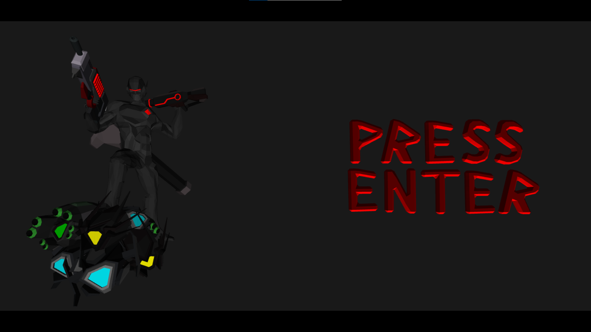
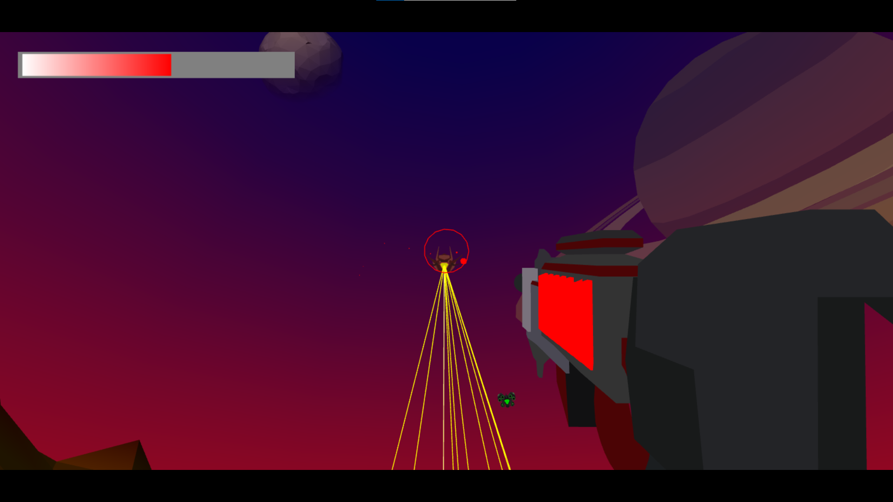
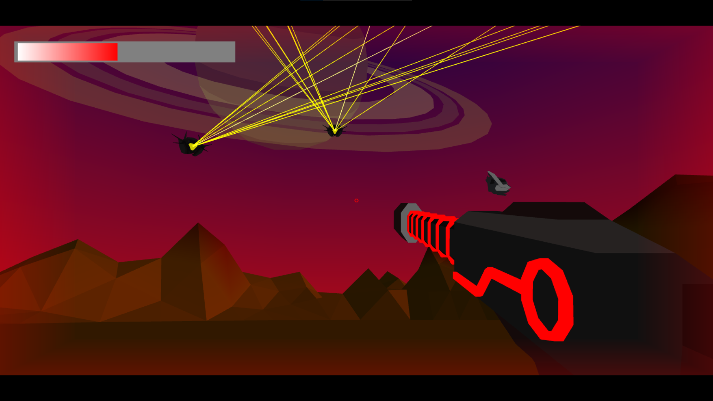
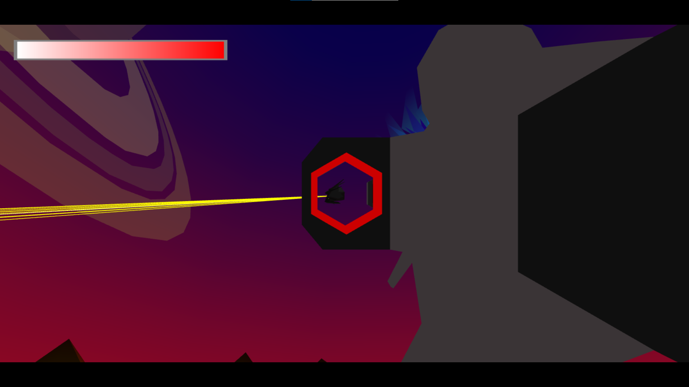
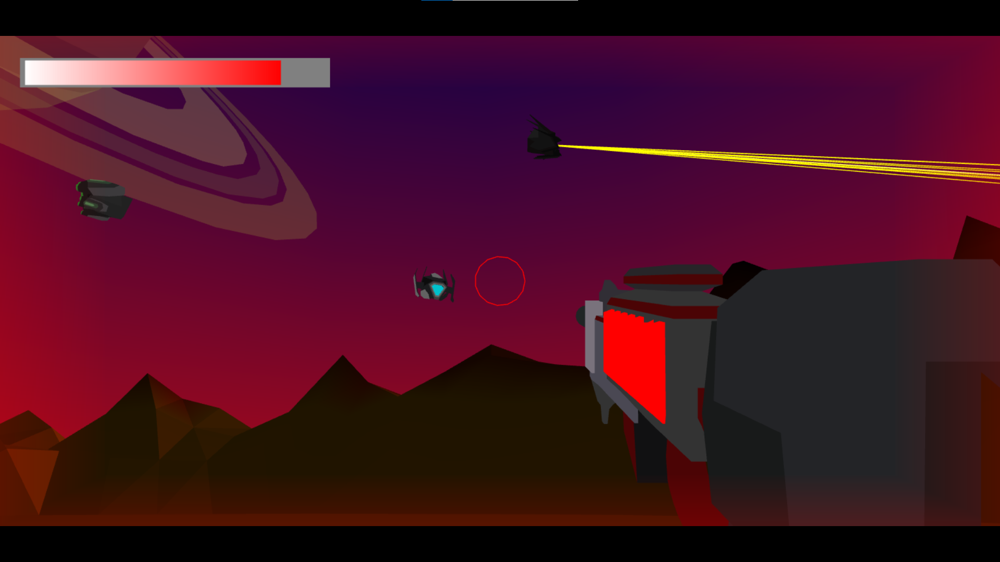

## Webgl 3d shooter game
I made this with webgl and js without three.js library .
link to play:
### Features

- 3 different weapons;
- 3 different enemy type with unique attacks and looks;
- scores;
- Compatible with all major browsers (chrome,edge,firefox);
- can run offline;

### controls
- W,A,S,D move character
- Q,E change weapons
- mouse drag camera look
- mouse left click fire weapon
- F fullscreen
- L infinite mouse movement 

### Screenshots

